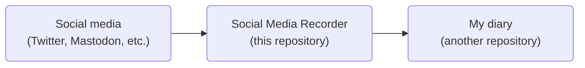

# Social Media Recorder
Social Media Recorder is a repository where my posts on several social media are integrated with [my diary](https://github.com/noraworld/diary). Even though this is my personal repository, you can establish a similar structure by following the instructions provided below.

## Setup
Every time something is posted from my accounts on social media, it is transferred to this repository. Each comment posted on [Issue #1](https://github.com/noraworld/social-media-recorder/issues/1) is moved to the latest issue on [my diary repository](https://github.com/noraworld/diary) automatically. Here's how to setup like that.



### IFTTT
[IFTTT](https://ifttt.com) is used here as it's way cheaper than subscribing to [the X (Twitter) API](https://developer.x.com/en/docs/x-api).

#### Upgrade plan
You need to upgrade your IFTTT account to [Pro or Pro+](https://ifttt.com/plans) to use the Twitter trigger "New tweet by you".

#### Register applets
Create your applets by following the instructions provided below.

##### Twitter
###### Trigger
| Field           | Value                                                  |
| --------------- | ------------------------------------------------------ |
| Twitter account | Your Twitter account information associated with IFTTT |
| retweets        | unchecked                                              |
| @replies        | unchecked                                              |


###### Action
| Field           | Value                                                 |
| --------------- | ----------------------------------------------------- |
| GitHub account  | Your GitHub account information associated with IFTTT |
| Repository Name | `noraworld/social-media-recorder`                     |
| Issue Number    | `1`                                                   |
| Comment         | See below                                             |

```
{{Text}}

> From [Twitter]({{LinkToTweet}})
```


##### Mastodon
###### Trigger
| Field                   | Value                                                          |
| ----------------------- | -------------------------------------------------------------- |
| Mastodon.social account | Your Mastodon.social account information associated with IFTTT |


###### Action
| Field           | Value                                                 |
| --------------- | ----------------------------------------------------- |
| GitHub account  | Your GitHub account information associated with IFTTT |
| Repository Name | `noraworld/social-media-recorder`                     |
| Issue Number    | `1`                                                   |
| Comment         | See below                                             |

```
{{ContentHtml}}


> From [Mastodon]({{Url}})
```


### Create workflow
Create a workflow by following [`comments-transferor.yml`](.github/workflows/comments-transferor.yml).

### Lock conversation
You should lock the conversation on [Issue #1](https://github.com/noraworld/social-media-recorder/issues/1) so that no one can post a comment here. Otherwise, someone's comment will be transferred to your another repository.

```shell
gh issue lock --repo noraworld/social-media-recorder 1
```
